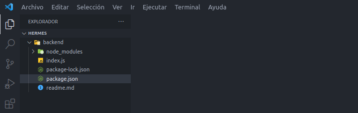

# guia de proyecto

[frontend](#levantaremos-nuestro-front-end) and [backend](#primero-levantaremos-una-back-end) preliminares para el proyecto.

## Back-End

- [tipiandfo en nuestro back-end](#tipiando-en-nuestro-back-end)

[]: # Language: markdown
[]: # Path: backend/readme.md

## primero levantaremos una Back-End

creamos una carpeta llamada backend en la rais de nuestro proyecto ya sea manualmente o desde la consola con el comando `mkdir backend`.


una vez que la carpeta se crea, abrimos una terminal integrada en nuestro vsCode y nos movemos a ella con el comando `cd backend` o desde nuestro editor favorito.
Con esto ya listo insertaremos lo siguuiente el terminal hubicada en la carpeta de nuestro backend:

```diff
npm init -y
```

esto nos inicializara el proyecto y nos creara un archivo llamado `package.json` que contiene toda la informacion necesaria para que nuestro proyecto funcione.


ahora procederemos a instalart unos modulos comunes y necesarios en todo proyecto que queremos crear.

```diff
npm i express dotenv
```


y lugo intalaremos por aparte el modulo nodemon que nos permitira iniciar nuestro servidor en cada cambio de archivo.
Ya que no es una dependencia nesesaria para que nuestro backend funcione, no la instalamos.
Como dependendia de nuestro proyecto sino como una dependencia de desarrollo.

```diff
npm i nodemon -D
```

Con todo esto nuestro package.json ya esta listo para ser usado.

crearemos un archivo llamado `index.js` en la carpeta de nuestro backend.



[]: # Language: markdown
[]: # Path: backend/readme.md.

## levantaremos nuestro front-end

crearemos una carpeta llamada frontend en la rais de nuestro proyecto ya sea manualmente o desde la consola con el comando `mkdir frontend`.
no olvidemos que si estamos usando la misma consola con la que creamos nuestro backend tendrtemos que retroceder un directorio para quedar ubicado en la rais de nuestro proyecto.

```diff
cd ..
```


una ves creada nuestra carpeta de frontend, nos movemos a ella con el comando `cd frontend` o desde nuestro editor favorito.
Con esto ya listo insertaremos lo siguuiente el terminal hubicada en la carpeta de nuestro frontend:

```diff
npx create-react-app .
```

esto nos creara un proyecto de react en el directorio en el que nos encontramos.

nuestro proyecto nos tendria que ir quedando de la sigiente manera:


con todo esto ya podremos enpesar a tipiar algo de codigo para que nuestro proyecto funcione basicamentre.</br>
Ya que react hace todo por nosotros, no necesitamos instalar ninguna dependencia.,</br>
Ni tipiar nada de codigo para verlo funcionar.
Solo tipiamos los siguiente desde la ubucacion de directorios que nos encontramos.
Ya que teoricamente tendriamos que aver quedao en la carpeta de nuestro frontend.

```diff
npm start
```

esto levantario nuestro frontend en [localhost:3000](http://localhost:3000/) si el puerto no esta ocupado con algun otro proyecto.

## tipiando en nuestro back-end

como entodo proyecto primero levantaremos una Back-End en algun puerto que no este ocupado.,</br>
Pero primero tendremos que inicializarlo con express.

```js
const express = require('express')

const app = express()

app.listen(5000 , () => {console.log('Server is running on port => 5000')})
```

en la primera linea requerimos el modulo express.
Y en la segunda linea creamos una variable app que va a ser una instancia de express.
Y en la tercera linea levantamos nuestro servidor en el puerto 5000 y en la funcion callback le decimos que cuando se levante el servidor, imprima un mensaje en consola.

pero como tipiar directamente el puerto no es una buena practica porque si lo cambiamos podemos tener problemas con el servidor.
Crearemos una variable de entorno con el modulo dotenv que nos permitira levantar nuestro servidor en un puerto que no este ocupado.

```js
const express = require('express')

const app = express()

require('dotenv').config( {path: './.env'} )
const puerto = process.env.PORT || 5000


app.listen(puerto , () => {
  console.log(`Server is running on port => ${puerto}`)
})
```

como podemos ver requerimos dotenv y lo configuramos con el path de nuestro archivo .env
Y en la tercera linea creamos una variable puerto que va a ser el puerto que levantaremos nuestro servidor.

y en nustro archivo .env tenemos una variable de entorno llamada PORT que nos permitira levantar nuestro servidor en un puerto que no este ocupado.

```env
PORT = 5000
```

ahora que todo esto esta listo para ser usado crearemos una respuesta get para nuestro servidor.
Para poder ver alguna respuesta de nuestro servidor en nuestro navegador en [http://localhost:5000/](http://localhost:5000/)

```js
const express = require('express')

const app = express()

require('dotenv').config( {path: './.env'} )
const puerto = process.env.PORT || 5000


app.get('/', (req, res) => {
    res.send('<h1>Hello World!</h1>')
})

app.listen(puerto , () => {
  console.log(`Server is running on port => ${puerto}`)
})

```

como puedes ver nos tendria que aparecer un hello world en nuestro navegador.
la sintaxis que envulve nustro hello world es html para que lo vemos mejor en el navegador.
Ya que sino se veria como una pagina de texto plano.
